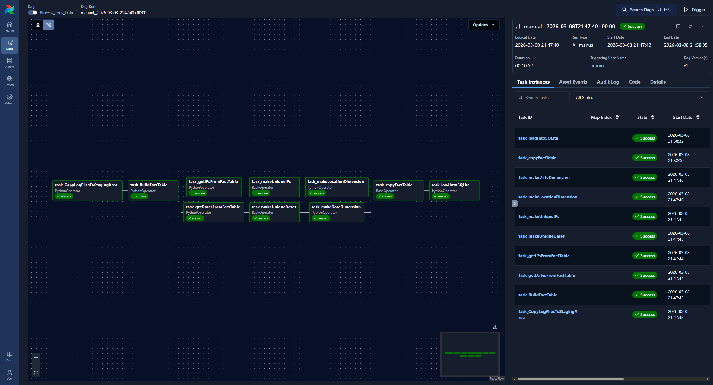
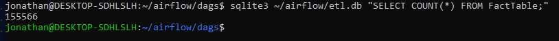

# Airflow ETL Pipeline for Web Log Processing

## Project Overview

This project implements an **ETL pipeline using Apache Airflow** to process IIS web server log data.  
The pipeline extracts raw log files, transforms them into a structured fact table, generates supporting dimension data, and loads the cleaned results into a **SQLite database** for analysis.

The goal of this project was to rebuild and understand an ETL workflow while demonstrating how **Airflow can orchestrate multi-stage data processing pipelines**.

## Technologies Used

- Python
- Apache Airflow
- SQLite
- Bash
- WSL / Ubuntu
- Git / Github

## ETL Pipeline Architecture

The Airflow DAG **Process_Logs_Data** orchestrates the ETL pipeline

### Pipeline Steps

1. **Copy Log Files to Staging Area**
   - The raw IIS web logs are copied into a staging directory for processing.

2. **Build Fact Table**
   - The log files containing two different formats (14-column and 18-column) are transformed into a unified fact table schema.

3. **Extract Raw IP Addresses**
   - The IP addresses are extracted from the fact table for later processing.

4. **Extract Raw Dates**
   - The date values are extracted from the fact table for later processing.

5. **Generate Unique IP Values**
   - Duplicate IP addresses are removed using a Bash command.

6. **Generate Unique Date Values**
   - Duplicate dates are removed using a Bash command.

7. **Create Location Dimension File**
   - A location dimension dataset is generated from the unique IP addresses and an external API.

8. **Create Date Dimension File**
   - A date dimension dataset is generated from the unique date values.

9. **Copy Fact Table to Star Schema Directory**
   - The completed fact table is moved to the schema output directory.

10. **Load Data into SQLite**
   - The cleaned fact table is loaded into a SQLite database.

## Data Quality Handling

This project was initially completed as an assignment in the University of Dundee. During this development cycle, there were several improvements made to help increase the robustness of the pipeline:

- Updated the depracated Apache Airflow syntax
- Removed blank rows during processing
- Added validation for malformed rows
- Ensured that only valid rows were inserted into the SQLite database
- Prevented ETL pipeline failures caused by inconsistent log data

## Example Airflow DAG Execution

Successful DAG execution in Apache Airflow:

## Database Verification

After the pipeline finished, the data was loaded into an SQLite database.
The fact table contains **155,566 rows**.

## Future Improvements

Potential improvements for this pipeline could include:

- Loading dimension tables into SQlite to create a full star schema
- Connecting the database directly to **Power BI** for data visualisation (previously exported the fact table and dimension tables as csv files to Power BI to perform the data visualisation)
- Implementing additional data validation checks
- Refactoring parsing logic using structured CSV handling

## Author

Jonathan Cormack

